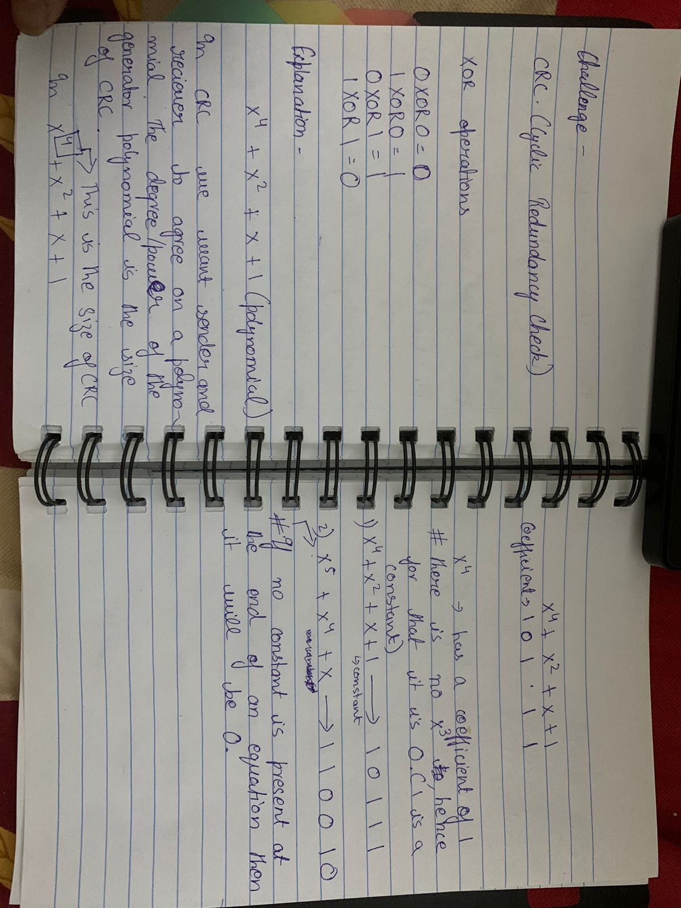
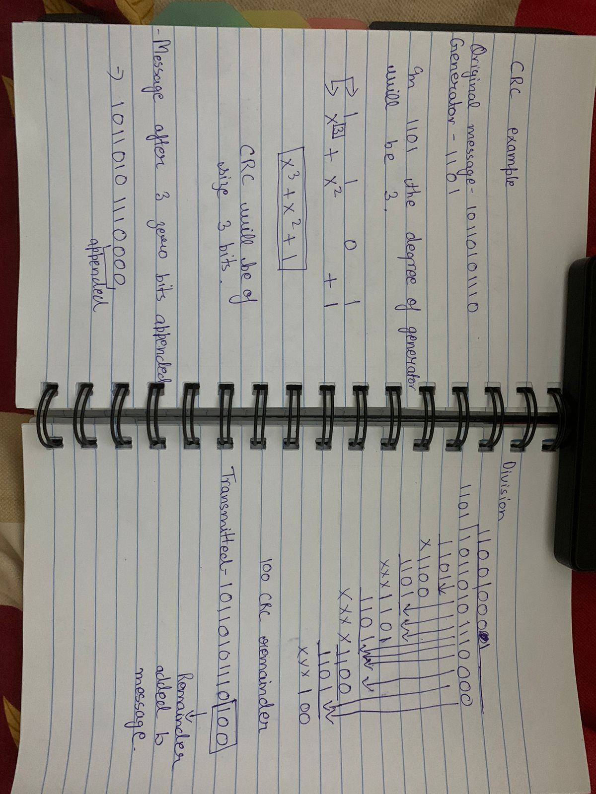
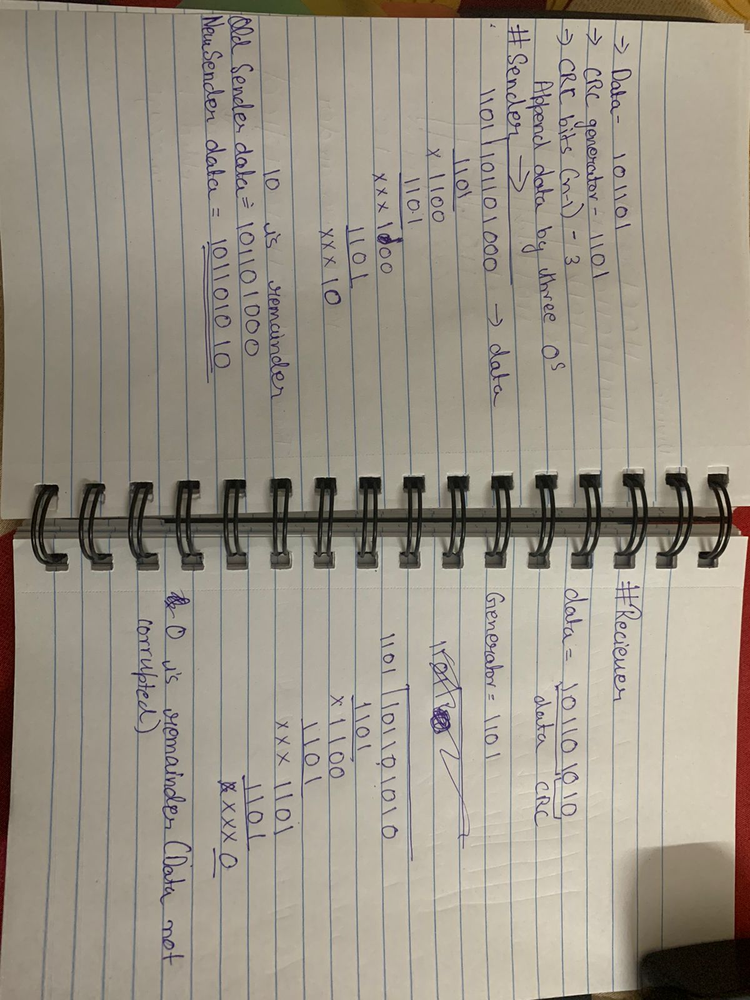

What Does Data Packet Mean?
A data packet is a unit of data made into a single package that travels along a given network path. 
Data packets are used in Internet Protocol (IP) transmissions for data that navigates the Web, and in other kinds of networks.

Cyclic Redundancy Check (CRC) or Polynomial Code Checksum
- Used in networks and storage devices.
- To check accidental changes to data transmitted.
- It is a complex algorithm.
- It is based on binary division.

Main Requirements for CRC check-
1- Data
2- CRC generator
3- CRC Bits

#if CRC generator = n bits, then CRC bits = (n-1)

Example-
 
Consider the CRC generator is x7 + x6 + x4 + x3 + x + 1.

The corresponding binary pattern is obtained as-

1x7 + 1x6 + 0x5 + 1x4 + 1x3 + 0x2 + 1x1 + 1x0
 |     |     |     |     |     |     |     |
 1     1     0     1     1     0     1     1

For the given CRC generator, the corresponding binary pattern is 11011011.

CHALLENGE #1

#define MAX_PACKET_DATA_LENGTH (50)

typedef struct data_packet_t{
    uint8_t id;
    uint8_t data_length;
    uint8_t data[MAX_PACKET_DATA_LENGTH];
    uint16_t crc;
}data_packet_t;

To check for packet corruption in the provided data_packet_t structure, you can use the CRC value included in the structure. The CRC is a common technique used to detect errors or corruption in data transmission.

Here's a step-by-step process to check for packet corruption:

1- Calculate the CRC value of the packet data, excluding the crc field itself. You can use a CRC algorithm like CRC-16 or CRC-32 to calculate the CRC value.

2-Compare the calculated CRC value with the crc field of the data_packet_t structure.

(If the calculated CRC value matches the crc field, the packet is likely not corrupted. If the calculated CRC value does not match the crc field, the packet may be corrupted.)